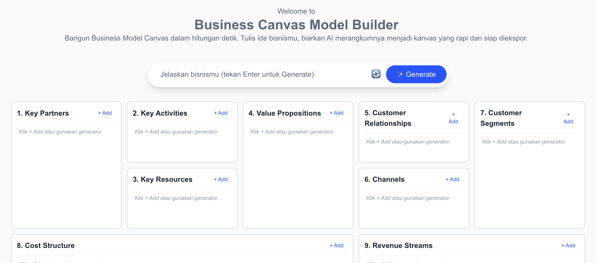

# 🚀 Biz-Go - Free Business Tools

<div align="center">
  
  
  <h3 align="center">Democratizing Business Tools for Everyone</h3>
  
  <p align="center">
    Open-source business planning tools powered by AI
    <br />
    <a href="https://biz-go.com"><strong>Try it Live »</strong></a>
    <br />
    <br />
    <a href="https://github.com/septiannuriyanto/biz-go/issues">Report Bug</a>
    ·
    <a href="https://github.com/septiannuriyanto/biz-go/issues">Request Feature</a>
    ·
    <a href="#contributing">Contribute</a>
  </p>
  
  <p align="center">
    
    
    
    
  </p>
</div>

---

## ✨ Features

### 🎯 Current Tools
- **BMC Builder** - AI-powered Business Model Canvas generator with full editing capabilities
- **Local Storage** - Your data stays in your browser, ensuring complete privacy
- **Export Options** - Download your canvas as JSON for backup and sharing
- **Free Forever** - No hidden costs, no premium tiers for basic features

### 🚧 Coming Soon
- **SWOT Analysis** - Strengths, Weaknesses, Opportunities, and Threats analyzer
- **Lean Canvas** - Streamlined canvas for startups
- **Pitch Deck Generator** - AI-assisted presentation builder
- **Financial Projections** - Basic financial modeling tools
- **Team Collaboration** - Real-time collaboration features

## 🖼️ Screenshots

<div align="center">
  
  <p><i>BMC Builder Interface</i></p>
</div>

## 🛠️ Tech Stack

- **Frontend:** Next.js 14, TypeScript, Tailwind CSS
- **AI Integration:** OpenRouter AI
- **Deployment:** Cloudflare
- **Database:** Supabase (for user accounts - coming soon)
- **Analytics:** Vercel Analytics
- **Storage:** Browser LocalStorage (for business data)

## 🚀 Getting Started

### Prerequisites

- Node.js 18+ 
- npm or yarn or pnpm
- OpenAI API key (for AI features)

### Installation

1. **Clone the repository**
   ```bash
   git clone https://github.com/septiannuriyanto/biz-go.git
   cd biz-go
   ```
   This project is packed as a monorepo project, and you should configure each folder separately as your respective workspace<br/>


   
2. **Starting frontend development**
    ```bash
    cd frontend
    npm i
    npm run dev

2. **Starting backend development (coming soon)**
    ```bash
    cd backend
    npm i
    npm start